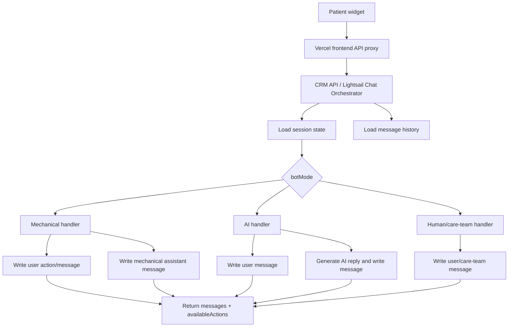
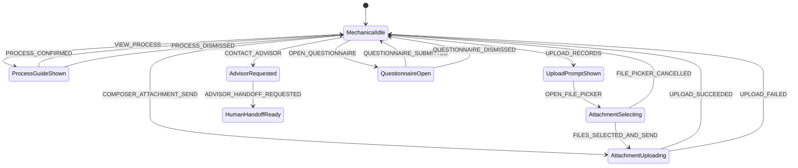
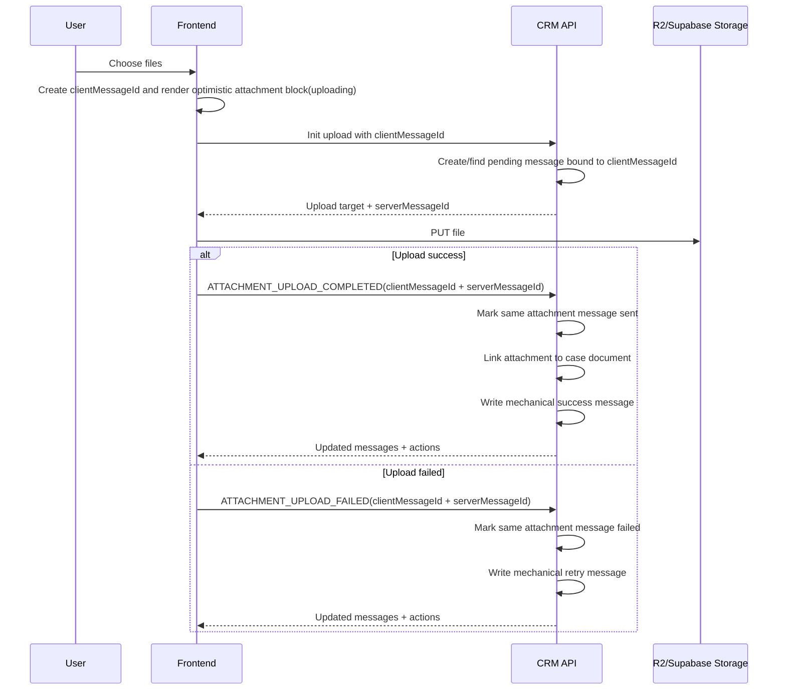
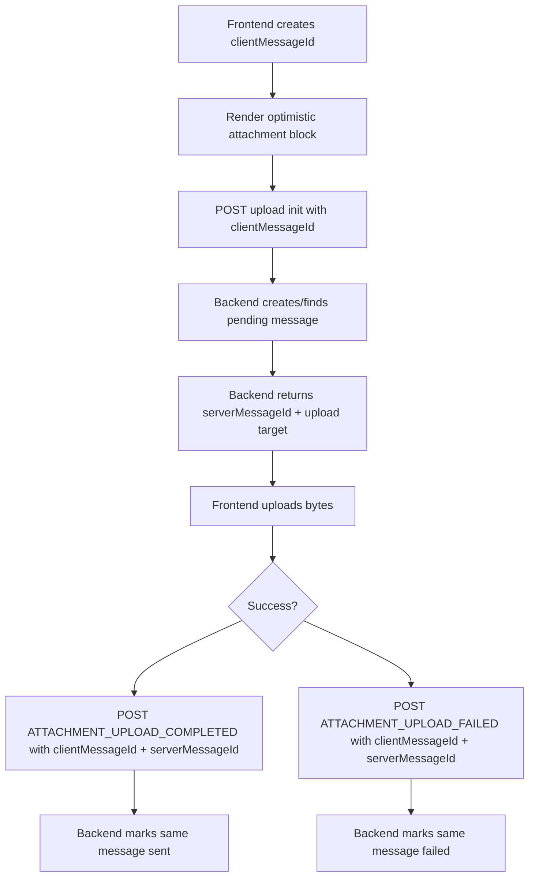

# 后端拥有的聊天状态机设计

日期：2026-06-02

## 背景

MedicalTourismChina 患者右下角聊天 widget 现在已经从自由 AI 聊天改成了“机械菜单式”流程：用户完成基础建档后，可以了解赴华就医流程、上传医疗资料、联系顾问、填写病情表。

当前实现的问题是：机械聊天状态主要由前端 reducer、本地 turns、composer 上传状态、session fallback 逻辑拼出来。它能短期工作，但不是一个干净的产品架构：

- 机械回复大多只是前端本地 UI state，不是 CRM message history 的一部分。
- 刷新页面、换设备、重新登录后，部分机械流程无法可靠恢复。
- 前端同时负责渲染、状态转移、业务规则、上传成功/失败解释，逻辑散在多个组件里。
- 以后如果要在机械 bot 和 AI bot 之间自由切换，前端本地状态机会和后端真实会话状态冲突。
- 用户上传的文件、机械回复、AI 回复、人工顾问消息应该都进入同一条 message history，但当前路径没有统一。

本设计把聊天状态机迁移到现有 CRM API / Lightsail 后端。前端只负责展示 message history、展示后端返回的 actions、把用户事件发给后端。

## 目标

1. 后端成为聊天会话的唯一状态权威。
2. 机械 bot、AI bot、人工顾问共享同一条 message history。
3. 用户点击菜单、输入文字、上传文件、确认流程、提交病情表都作为 chat event 进入后端。
4. 后端根据当前 session mode 决定由机械规则、AI bot 还是人工模式处理。
5. 自动生成内容和用户内容都写入 CRM message history。
6. 前端清理旧的本地机械状态机逻辑，变成 message/actions renderer。
7. 上传医疗资料时，文件消息先以 uploading block 出现在聊天框里，成功/失败后更新状态并写入 history。
8. 所有自动文案、按钮、状态提示都支持中英文国际化。

## 非目标

- 不在 public content API 里承载患者聊天状态机。
- 不把 localStorage 或 React state 当成最终状态来源。
- 不在前端继续维护业务级机械状态转移。
- 不在这一步设计复杂多轮 AI 医疗问诊能力；AI bot 只需要通过同一 orchestrator 预留切换入口。
- 不改变医生、医院、疾病、package 等 public read API 的职责。

## 推荐架构

采用现有 CRM API / Lightsail 后端作为 `Chat Orchestrator`。



前端的权威输入只有：

- `messages`
- `availableActions`
- `composerPolicy`
- `sessionState`

前端的输出只有：

- `CHAT_ACTION_SELECTED`
- `TEXT_MESSAGE_SUBMITTED`
- `ATTACHMENT_UPLOAD_STARTED`
- `ATTACHMENT_UPLOAD_COMPLETED`
- `ATTACHMENT_UPLOAD_FAILED`
- `PROCESS_GUIDE_CONFIRMED`
- `PROCESS_GUIDE_DISMISSED`
- `QUESTIONNAIRE_OPENED`
- `QUESTIONNAIRE_SUBMITTED`
- `ADVISOR_HANDOFF_REQUESTED`

## 会话模式

后端 session state 至少需要支持三种模式：

| 模式 | 说明 | 自动回复来源 | 用户能否自由输入 | 文件能否上传 |
| --- | --- | --- | --- | --- |
| `mechanical` | 建档后的菜单式流程 | 固定规则状态机 | 默认禁用，可按策略开放 | 可以 |
| `ai` | AI bot 自动回复 | AI 模型或 AI 服务 | 可以 | 可以 |
| `human` | 人工顾问接手 | 无自动回复 | 可以 | 可以 |

模式切换由后端控制。前端不能通过本地判断强行进入某个模式。

典型切换：

- 完成基础建档后，后端把 session 设为 `mechanical`。
- 管理员或业务规则允许 AI 时，后端可以切到 `ai`。
- 用户点击“联系顾问”或管理员接管后，后端切到 `human` 或保持 `mechanical` 但禁用自动菜单。

模式切换必须通过后端事件完成，不能由前端本地直接切换。

| 事件 | 谁可以触发 | 后端行为 | 是否写入 history |
| --- | --- | --- | --- |
| `BOT_MODE_CHANGED` | admin/system | 更新 `botMode`，重算 policies | 是 |
| `ADVISOR_HANDOFF_REQUESTED` | patient | 写 handoff 请求，可切到 `human` | 是 |
| `ADMIN_TAKEOVER_STARTED` | admin/system | 切到 `human`，停止所有自动回复 | 是 |
| `AI_ENABLED_FOR_SESSION` | admin/system | 切到 `ai`，后续 text event 走 AI handler | 是 |
| `MECHANICAL_ENABLED_FOR_SESSION` | admin/system | 切到 `mechanical`，恢复菜单策略 | 是 |

一旦 `botMode = "human"`，后端必须停止机械回复和 AI 回复。前端仍可以发送用户文字和附件，但只写入 history，不触发自动 assistant message。

## 后端状态模型

推荐新增或复用 session metadata 存储：

```ts
type ChatSessionState = {
  sessionId: string;
  caseId: string;
  patientId: string;
  botMode: 'mechanical' | 'ai' | 'human';
  locale: 'zh' | 'en';
  mechanical: {
    processGuideConfirmed: boolean;
    questionnaireSubmitted: boolean;
    advisorRequested: boolean;
    medicalRecordsUploaded: boolean;
    activeTurnId: string | null;
    activeAction: MechanicalActionKey | null;
  };
  updatedAt: string;
};
```

`ChatSessionState` 只存业务事实，不持久化 `availableActions`。

`availableActions` 和 `composerPolicy` 必须由后端在每次响应时根据 `botMode`、mechanical flags、权限、case 状态动态计算。它们可以在响应里返回，也可以短期缓存用于性能优化，但不能作为业务事实来源持久保存。否则会出现 action 列表和真实状态不一致的问题。

`composerPolicy` 由后端返回，避免前端自己猜：

```ts
type ComposerPolicy = {
  textEnabled: boolean;
  attachmentsEnabled: boolean;
  sendEnabledWhen: 'text_or_attachment' | 'attachment_only' | 'disabled';
  placeholderKey: string;
};
```

## Message History 契约

机械、AI、用户、人工消息都写入同一条 message history。每条消息必须能表达来源、类型和状态。

```ts
type ChatMessage = {
  id: string;
  sessionId: string;
  clientMessageId?: string;
  role: 'user' | 'assistant' | 'system';
  source: 'patient' | 'mechanical_bot' | 'ai_bot' | 'care_team' | 'system';
  contentType: 'text' | 'action' | 'attachment' | 'rich_card' | 'event';
  content: string;
  locale: 'zh' | 'en';
  status: 'pending' | 'uploading' | 'sent' | 'failed';
  attachments?: ChatAttachment[];
  metadata: {
    botMode?: 'mechanical' | 'ai' | 'human';
    actionKey?: MechanicalActionKey;
    eventType?: string;
    turnId?: string;
    uploadStatus?: 'uploading' | 'uploaded' | 'failed';
    errorCode?: string;
  };
  createdAt: string;
};
```

`clientMessageId` 是前端生成的幂等键。任何会产生乐观 UI 的事件都必须带 `clientMessageId`，后端必须把它绑定到创建出的 message。后端返回的 `id` 是 `serverMessageId`。前端 reconcile 时规则如下：

1. 前端创建 optimistic message，并记录 `clientMessageId`。
2. 后端创建或找到同一个 `clientMessageId` 对应的 message，返回 `serverMessageId`。
3. 后续完成/失败事件同时携带 `clientMessageId` 和 `serverMessageId`。
4. 前端用 `serverMessageId` 优先匹配；如果还没有 server id，则用 `clientMessageId` 匹配。
5. 后端必须对同一 `clientMessageId` 幂等，避免双击或重试产生重复 attachment message。

机械回复不要再只存在前端 local turns。后端处理 action 后，应该写入：

1. 用户 action message，例如“用户选择：上传医疗资料”。
2. 机械 assistant message，例如“请选择要上传的医疗资料”。
3. 必要时写入 rich card metadata，让前端渲染流程卡片、上传卡片或按钮组。

## 机械状态机

机械状态机由后端处理。前端只展示当前 message history 和 `availableActions`。



### Action 规则

| Action | 后端处理 | Message history |
| --- | --- | --- |
| `VIEW_PROCESS` | 写入流程说明 rich card | user action + mechanical rich card |
| `PROCESS_CONFIRMED` | 标记 `processGuideConfirmed = true` | user confirmation + mechanical completion |
| `PROCESS_DISMISSED` | 不标记确认 | user/system event + mechanical reminder |
| `UPLOAD_RECORDS` | 返回上传说明和 composer policy | user action + mechanical upload prompt |
| `UPLOAD_SUCCEEDED` | 标记 `medicalRecordsUploaded = true` | attachment message + mechanical success |
| `UPLOAD_FAILED` | 不标记完成，恢复 actions | failed attachment message + mechanical retry |
| `CONTACT_ADVISOR` | 标记 `advisorRequested = true`，可切 human | user action + mechanical handoff |
| `OPEN_QUESTIONNAIRE` | 返回病情表 open command | user action + mechanical form prompt |
| `QUESTIONNAIRE_SUBMITTED` | 标记 `questionnaireSubmitted = true` | form submitted event + mechanical completion |

## 上传医疗资料流程

上传必须进入 message history，并且要体现状态。



关键规则：

- 用户打开文件选择器但没有选文件：不写 message，不显示“已完成”。
- 用户选择文件后点击发送：聊天框立即显示 patient attachment block，状态为 uploading。
- 上传成功：block 变为 uploaded/sent，后端追加机械成功回复。
- 上传失败：block 变为 failed，后端追加机械失败回复，并恢复 action bar。
- 失败文案和状态标签必须国际化。

### 上传 message 对账规则

上传链路必须避免重复 message，也必须能把 optimistic block 准确更新为成功或失败。



`clientMessageId` 由前端创建，并贯穿 upload init、storage upload、completed/failed event。后端必须以 `clientMessageId` 做幂等 upsert，不能因为前端重试而创建多条上传 message。

上传成功后必须同时完成三件事：

1. message history 中有一条 `contentType = "attachment"` 的 patient message。
2. CRM case document list 中能看到同一份文件。
3. message attachment 和 case document 通过 `attachmentId` 或 `documentId` 可互相追踪。

如果其中任意一项失败，后端不能把上传整体标记为完成。可以先把 bytes 保留在 storage 中，但聊天状态必须显示 failed 或 needs-retry，并记录可排查的 `errorCode`。

## 前端清理要求

这次迁移必须清理之前不干净的前端机械状态机逻辑。目标不是在后端加一套，同时前端还保留一套。

需要移除或降级的前端职责：

- 删除业务级 `mechanical-chat-state-machine.ts` reducer，或把它改成纯 UI helper，不能再决定业务状态转移。
- `MechanicalChatMenu` 不再维护 `turns`、`optimisticProcessConfirmed`、`advisorCompleted` 等业务状态。
- `PatientEntryWindow` 不再通过 `AI_ACTIVE` fallback 自行推断是否启用机械聊天；它只信任后端返回的 `botMode` 和 `availableActions`。
- `PatientChatComposer` 不再决定 “mechanical upload 是否完成”；它只负责本地文件选择、optimistic UI、调用上传 API。
- 所有机械文案从后端 message 或 i18n key 渲染，不在多个前端组件里硬编码。
- action bar 显示/隐藏由后端 `availableActions` 和 `composerPolicy` 派生，不由前端 turn 状态猜。

保留的前端职责：

- 渲染 text/rich_card/action/attachment message。
- 根据 message status 显示 uploading/sent/failed。
- 处理文件选择器取消这种纯浏览器事件。
- 对上传 block 做短期 optimistic 渲染；后端返回后以 message history 为准。
- 展示后端给出的 buttons/actions，并把点击事件发回后端。

## API 设计

推荐新增统一 chat event endpoint：

```http
POST /sessions/:sessionId/chat/events
```

请求：

```json
{
  "eventType": "ACTION_SELECTED",
  "actionKey": "UPLOAD_RECORDS",
  "locale": "en",
  "clientMessageId": "client-...",
  "payload": {}
}
```

响应：

```json
{
  "sessionState": {
    "botMode": "mechanical",
    "availableActions": [],
    "composerPolicy": {
      "textEnabled": false,
      "attachmentsEnabled": true,
      "sendEnabledWhen": "attachment_only",
      "placeholderKey": "chat.upload.placeholder"
    }
  },
  "messages": [],
  "commands": [
    {
      "type": "OPEN_FILE_PICKER",
      "accept": "medical_documents"
    }
  ]
}
```

上传可以保留现有 init/upload message API，但需要被 orchestrator 统一记录：

```http
POST /sessions/:sessionId/attachments/upload
POST /sessions/:sessionId/chat/events
```

上传完成事件：

```json
{
  "eventType": "ATTACHMENT_UPLOAD_COMPLETED",
  "clientMessageId": "client-...",
  "payload": {
    "serverMessageId": "server-message-id",
    "attachments": [
      {
        "id": "attachment-id",
        "documentId": "case-document-id",
        "fileName": "ct-report.pdf",
        "mimeType": "application/pdf",
        "size": 12345
      }
    ]
  }
}
```

### 旧 API 迁移矩阵

| 旧前端/接口 | 当前问题 | 新契约 | 兼容策略 | 删除时间点 |
| --- | --- | --- | --- | --- |
| `sendSessionMessage(..., mechanicalMode: true)` / `POST /sessions/:id/messages?mode=mechanical` | 前端决定 mechanical bypass，后端只接收结果，不能统一状态机 | `POST /sessions/:id/chat/events`，`eventType = TEXT_MESSAGE_SUBMITTED` 或 attachment completed event | 阶段 1 保留，只允许 attachment-only；阶段 2 前端停止调用 | 前端完成切换并验证 upload 后删除 |
| `initSessionAttachmentUpload(..., mechanicalMode: true)` / `POST /sessions/:id/attachments/upload?mode=mechanical` | upload init 和 chat state 分离，容易重复或无法 reconcile | upload init 必须带 `clientMessageId`，后端创建 pending attachment message 并返回 `serverMessageId` | 阶段 1 扩展旧 endpoint 支持 `clientMessageId`；阶段 2 接入 orchestrator | 新 upload event path 稳定后删除 `mode=mechanical` query |
| `confirmProcessGuide` | 单独确认流程，不是统一 chat event | `POST /sessions/:id/chat/events`，`eventType = PROCESS_GUIDE_CONFIRMED` | 阶段 1 可由旧 endpoint 内部转发到 orchestrator | 前端不再直接调用后删除 |
| `MechanicalChatMenu` local action turns | 机械消息不进 history，刷新丢失 | 后端写 user action + mechanical assistant message，前端只渲染 messages/actions | 阶段 2 用后端 actions 替代 | 阶段 3 删除 local turns |
| `mechanical-chat-state-machine.ts` reducer | 前端拥有业务状态机 | 删除，或降级为纯 UI mapper | 阶段 2 禁止 reducer 决定业务状态 | 阶段 3 删除/重命名 |
| `PatientEntryWindow` 的 `AI_ACTIVE` fallback mechanical enablement | 前端自己猜 bot mode，容易和后端冲突 | 只信任后端 `botMode` 和 `availableActions` | 阶段 1 后端返回 mode；阶段 2 前端切换 | 阶段 3 删除 fallback |
| `mechanical upload completion nonce` | 上传完成靠前端 nonce 推动菜单完成 | 后端 `ATTACHMENT_UPLOAD_COMPLETED` 写 history 并返回新 actions | 阶段 2 只作为 optimistic UI 临时状态 | 阶段 3 删除 |

## 国际化

后端可以返回最终文案，也可以返回 `i18nKey + params`。推荐短期返回最终文案，metadata 保留 key：

```json
{
  "content": "Upload failed. Please try uploading the file again.",
  "locale": "en",
  "metadata": {
    "i18nKey": "chat.upload.failed"
  }
}
```

所有机械文案必须覆盖：

- menu action labels
- process guide modal/rich card
- upload prompt
- uploading/uploaded/failed labels
- advisor handoff reply
- questionnaire prompt/completion reply
- composer placeholder

## 兼容与迁移

迁移应分阶段，避免一次性切坏线上聊天。

### 阶段 1：后端 orchestrator 和 message contract

- 在 CRM API 增加 chat session state。
- 增加 `/chat/events` endpoint。
- 机械 action 开始写入 message history。
- 上传完成/失败事件写入 message history。

### 阶段 2：前端切换为后端状态

- 前端读取后端返回的 `botMode`、`messages`、`availableActions`、`composerPolicy`。
- 停止使用本地 reducer 决定业务状态。
- 保留短期 optimistic upload UI，但后端消息返回后进行 reconcile。

### 阶段 3：清理旧逻辑

- 删除旧 reducer 或把它降级成无业务含义的 render helper。
- 删除 local turns、fallback mechanical enablement、分散 completion nonce。
- 删除硬编码机械文案。
- 清理与 `mechanicalMode` query 参数有关的临时分支，改为统一 event contract。

## 错误处理

| 错误 | 后端行为 | 前端行为 |
| --- | --- | --- |
| 上传 init 失败 | 写 failed message 或返回 retry error | optimistic block 变 failed，显示 retry message |
| R2 PUT 失败 | 接收 failed event 并写 history | block 变 failed，恢复 actions |
| 上传完成通知失败 | 前端重试通知；超时后显示 failed | 不能显示 uploaded |
| chat event endpoint 失败 | 不推进状态 | 显示当前 action 的错误提示 |
| AI 服务失败 | 写 AI failed assistant/system message | 前端按普通 message 渲染 |
| session state 冲突 | 后端以 DB 当前状态为准 | 前端丢弃本地 pending 业务状态 |

## 测试计划

### 后端

- `ACTION_SELECTED: VIEW_PROCESS` 写入 user action 和 mechanical rich card。
- `PROCESS_CONFIRMED` 更新 session state 并写 completion message。
- `UPLOAD_RECORDS` 返回 attachment-only composer policy。
- 上传成功写 attachment message 和 mechanical success message。
- 上传失败写 failed attachment message 和 retry message。
- `CONTACT_ADVISOR` 写 handoff message，并按业务规则切换到 `human` 或保持 `mechanical`。
- `botMode = ai` 时，同一 text event 写 user message 和 AI reply。
- `botMode = human` 时，不生成机械或 AI 自动回复。
- 同一 event 使用 `clientMessageId` 去重，避免用户双击导致重复消息。

### 前端

- 英文界面所有 action 和机械回复都是英文。
- 中文界面所有 action 和机械回复都是中文。
- 刷新页面后，机械历史从 message history 恢复。
- 点击上传但取消文件选择，不出现完成消息。
- 上传中立即显示 attachment message block。
- 上传失败显示 failed block 和 retry 机械回复。
- 上传成功显示 sent block 和 success 机械回复。
- action bar 只由 `availableActions` 渲染。
- composer 只由 `composerPolicy` 控制。
- 删除旧 reducer 后，dashboard/chat widget 不出现空引用或 `mechanicalChat` null crash。

## 验收标准

- 前端没有业务级机械状态机。
- 后端可以通过 session state 切换 `mechanical`、`ai`、`human`。
- 机械自动回复、AI 自动回复、用户消息、上传资料全部进入同一条 message history。
- CRM 管理端能看到患者的关键机械流程记录和上传文件。
- 刷新页面不会丢失机械聊天历史。
- 取消文件选择不会产生“已完成”消息。
- 上传失败不会假装成功，并且能让用户重新上传。
- 所有新增机械文案都有中英文。
