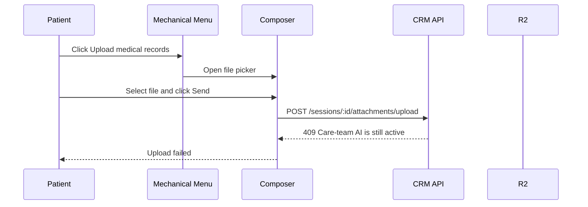
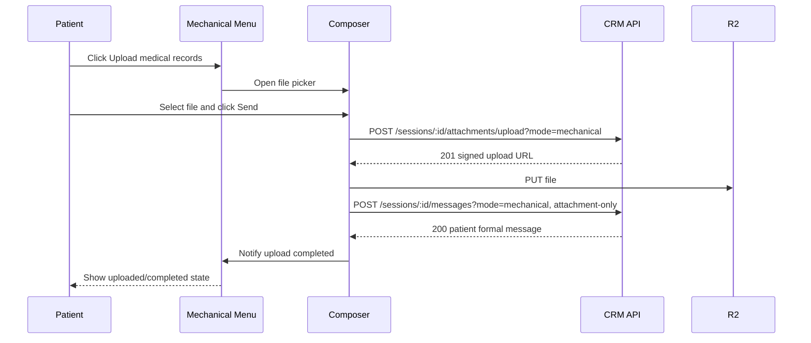
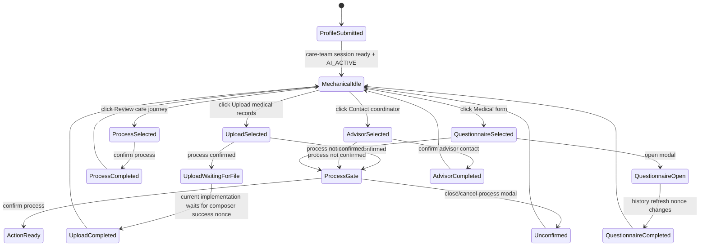
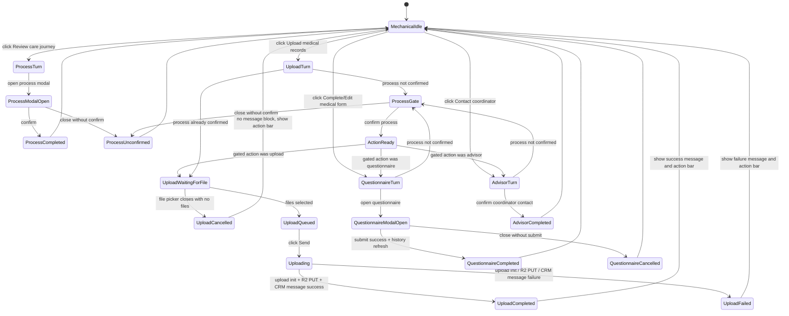

# Mechanical Chat State Machine Analysis

Date: 2026-06-02

## Scope

This document explains the current mechanical chat behavior in the MedicalTourismChina patient widget and defines the target state machine for the non-AI menu flow.

The immediate focus is the post-profile care-team widget flow:

- Review the medical travel process.
- Upload medical records.
- Contact a coordinator.
- Complete or edit the medical questionnaire.

This document also explains the recent medical-record upload failure and the required future behavior for upload message blocks, loading states, failed states, and internationalized copy.

## Upload Failure Root Cause

The upload failure was not primarily an R2 upload problem. The failure happened because the widget was in mechanical mode while the CRM care-team conversation was still marked `AI_ACTIVE`.

Before the fix, the frontend tried to upload records through the formal care-team session endpoint:



The CRM guard was reasonable for normal free-text chat: when the care-team conversation is `AI_ACTIVE`, patients should not send arbitrary formal messages to the care team. However, mechanical menu uploads are different. They are a constrained menu action, not free text.

The deployed fix made the upload path explicit:



The backend bypass is intentionally narrow:

- It only applies to care-team sessions.
- It only applies when `mode=mechanical`.
- Upload initialization is allowed while `AI_ACTIVE`.
- Formal message send is allowed only when the message is attachment-only.
- Free-text care-team messages remain blocked while `AI_ACTIVE`.

## Current Implementation Problems

The current mechanical chat is not a single state machine. Its state is split across several places:

- `MechanicalChatMenu`
  - Tracks local `turns`.
  - Tracks optimistic process confirmation.
  - Tracks questionnaire completion.
  - Tracks advisor completion.
- `PatientChatComposer`
  - Tracks selected files.
  - Tracks send state.
  - Decides whether to use formal session, chatbot session, or no target.
- `PatientEntryWindow`
  - Decides whether mechanical chat is enabled.
  - Converts successful formal upload messages into a menu completion nonce.
- CRM API
  - Enforces `AI_ACTIVE` vs `HUMAN_TAKEOVER` permissions.
  - Provides the mechanical upload bypass.

Because these concerns are separate, several confusing states can appear:

- Opening the file picker used to mark upload as complete even when the patient selected no file.
- Upload success was not represented as a patient message block with a visible progress state.
- Upload failure produced an API error, but the menu did not have a clean failed state.
- The action bar could remain hidden because a selected turn stayed active.
- Mechanical messages were partially hardcoded and could ignore the selected language.

## Current High-Level State Machine

The current implementation behaves approximately like this:



This is better than the earlier behavior, but it is still incomplete because upload progress and upload failure are not first-class states in the chat stream.

## Target State Machine

The target state machine should treat each mechanical action as a turn with explicit state, not as scattered component state.



## State Rules

| State | Visible chat content | Action bar | Composer text input | Attachment button | Send button |
| --- | --- | --- | --- | --- | --- |
| `MechanicalIdle` | Intro plus completed history | Visible | Disabled | Enabled only if a formal/mechanical target exists | Disabled unless selected files exist |
| `ProcessTurn` | Assistant pre-message plus process modal trigger | Hidden | Disabled | Disabled | Disabled |
| `ProcessModalOpen` | Modal open | Hidden | Disabled | Disabled | Disabled |
| `ProcessCompleted` | Process confirmation post-message | Visible | Disabled | Depends on target | Disabled unless selected files exist |
| `ProcessUnconfirmed` | Unconfirmed assistant message | Visible | Disabled | Depends on target | Disabled unless selected files exist |
| `UploadWaitingForFile` | Upload instruction card | Hidden | Disabled | Enabled | Disabled until files selected |
| `UploadCancelled` | No upload message block | Visible | Disabled | Depends on target | Disabled unless selected files exist |
| `UploadQueued` | Composer file chips | Hidden | Disabled | Enabled | Enabled |
| `Uploading` | Patient upload message block with loading status | Hidden | Disabled | Disabled | Disabled |
| `UploadCompleted` | Patient upload block with success plus assistant success message | Visible | Disabled | Depends on target | Disabled unless selected files exist |
| `UploadFailed` | Patient upload block with failed status plus assistant failure message | Visible | Disabled | Enabled | Disabled until files selected |
| `AdvisorTurn` | Advisor card | Hidden | Disabled | Disabled | Disabled |
| `AdvisorCompleted` | Advisor post-message | Visible | Disabled | Depends on target | Disabled unless selected files exist |
| `QuestionnaireTurn` | Questionnaire trigger card | Hidden | Disabled | Disabled | Disabled |
| `QuestionnaireModalOpen` | Questionnaire modal open | Hidden | Disabled | Disabled | Disabled |
| `QuestionnaireCompleted` | Questionnaire completion message | Visible | Disabled | Depends on target | Disabled unless selected files exist |
| `QuestionnaireCancelled` | No completion message | Visible | Disabled | Depends on target | Disabled unless selected files exist |

## Upload Message Block States

Medical-record uploads must appear in the chat stream as patient message blocks. This should happen before the network upload completes, so the patient gets immediate feedback.

| Upload block state | Trigger | UI behavior | Next state |
| --- | --- | --- | --- |
| `file_selected` | Patient chooses files | Show file chips in composer only; do not add chat message yet | `uploading` after Send, or `cancelled` if files removed |
| `uploading` | Patient clicks Send | Insert patient message block immediately with thumbnails/file cards and a loading indicator | `uploaded` or `failed` |
| `uploaded` | R2 upload and CRM message both succeed | Replace loading indicator with success/check; keep message block in stream | Mechanical action completes |
| `failed` | Upload init, R2 PUT, proxy upload, or CRM message fails | Replace loading indicator with failed/error status; add assistant failure message | Action bar reappears |
| `cancelled` | File picker closes with no selected file | Do not add a message block; do not show completed | Action bar reappears |

The failure assistant message must be internationalized:

- English: `Upload failed. Please try uploading the file again.`
- Chinese: `上传失败了，请重新上传这个文件。`

The upload message block itself also needs internationalized status labels:

- `Uploading...`
- `Uploaded`
- `Upload failed`

## Click Behavior Matrix

| User action | Current state | Expected behavior |
| --- | --- | --- |
| Click `Review care journey` | `MechanicalIdle` | Hide action bar, append pre-message, show process trigger |
| Confirm process modal | `ProcessModalOpen` | Persist confirmation, append completed message, show action bar |
| Close process modal without confirming | `ProcessModalOpen` | Append unconfirmed message, show action bar |
| Click `Upload medical records` before process confirmation | `MechanicalIdle` | Hide action bar, append gated pre-message, show process trigger |
| Confirm gated process for upload | `ProcessGate` | Persist confirmation, keep upload turn active, show upload card |
| Click `Choose files` | `UploadWaitingForFile` | Open file picker |
| Close file picker with no files | `UploadWaitingForFile` | Do not add message; show action bar |
| Select files | `UploadWaitingForFile` | Show composer file chips; keep upload turn active |
| Click `Send` with selected files | `UploadQueued` | Add patient upload message block in `uploading`; disable composer/action bar |
| Upload succeeds | `Uploading` | Mark block uploaded, append success assistant message, show action bar |
| Upload fails | `Uploading` | Mark block failed, append retry assistant message, show action bar |
| Click `Contact coordinator` before process confirmation | `MechanicalIdle` | Require process confirmation first |
| Confirm coordinator contact | `AdvisorTurn` | Append advisor post-message, hide advisor action if already completed, show action bar |
| Click `Complete medical form` before process confirmation | `MechanicalIdle` | Require process confirmation first |
| Open medical form | `QuestionnaireTurn` | Open questionnaire modal; keep turn active |
| Submit medical form | `QuestionnaireModalOpen` | Wait for history refresh nonce, then append completion and show action bar |
| Close medical form without submitting | `QuestionnaireModalOpen` | Do not append completion; show action bar |

## Backend Contract

Mechanical upload is not the same as normal AI chat or normal human takeover messaging.

Allowed while care-team conversation is `AI_ACTIVE`:

- `POST /sessions/:sessionId/attachments/upload?mode=mechanical`
- `POST /sessions/:sessionId/messages?mode=mechanical` only when:
  - `attachments.length > 0`
  - `content.trim().length === 0`
  - target conversation is the patient's care-team session

Still blocked while care-team conversation is `AI_ACTIVE`:

- Free-text formal messages.
- Mechanical messages with free text.
- Non-mechanical formal messages to the care-team session.

This preserves the no-free-AI-chat product decision while allowing patient documents to enter the CRM case.

## Recommended Refactor

The next implementation should convert mechanical chat to a reducer-driven state machine.

Suggested types:

```ts
type MechanicalState =
  | { status: 'idle'; completed: CompletedMechanicalActions }
  | { status: 'process_modal'; actionKey: MechanicalActionKey; gated: boolean }
  | { status: 'upload_waiting_for_file'; turnId: string }
  | { status: 'upload_queued'; turnId: string; files: File[] }
  | { status: 'uploading'; turnId: string; files: UploadingFileView[] }
  | { status: 'upload_failed'; turnId: string; files: FailedFileView[]; error: string }
  | { status: 'questionnaire_open'; turnId: string; repeat: boolean }
  | { status: 'advisor_pending'; turnId: string };

type MechanicalEvent =
  | { type: 'ACTION_SELECTED'; actionKey: MechanicalActionKey }
  | { type: 'PROCESS_CONFIRMED' }
  | { type: 'PROCESS_DISMISSED' }
  | { type: 'FILES_SELECTED'; files: File[] }
  | { type: 'FILE_PICKER_CANCELLED' }
  | { type: 'UPLOAD_STARTED'; optimisticMessageId: string }
  | { type: 'UPLOAD_SUCCEEDED'; messageId: string }
  | { type: 'UPLOAD_FAILED'; error: string }
  | { type: 'QUESTIONNAIRE_OPENED' }
  | { type: 'QUESTIONNAIRE_SUBMITTED' }
  | { type: 'QUESTIONNAIRE_DISMISSED' }
  | { type: 'ADVISOR_CONFIRMED' };
```

All UI should be derived from this state:

- Whether the action bar is visible.
- Whether text input is disabled.
- Whether attachment selection is enabled.
- Whether Send is enabled.
- Which assistant message appears.
- Which patient upload message block state appears.

This removes the hidden coupling between `MechanicalChatMenu`, `PatientChatComposer`, `PatientEntryWindow`, and API errors.

## Testing Plan

Minimum tests for the next implementation:

- English mechanical menu renders all menu labels and messages in English.
- Chinese mechanical menu renders all menu labels and messages in Chinese.
- Clicking upload and cancelling file picker does not show a message block or completed state.
- Selecting a file and clicking Send immediately inserts an uploading message block.
- Successful upload changes the block to uploaded, appends success assistant copy, and shows action bar.
- Failed upload changes the block to failed, appends retry assistant copy, and shows action bar.
- Mechanical attachment-only upload uses `mode=mechanical`.
- Mechanical free-text sends remain blocked while `AI_ACTIVE`.
- Questionnaire only completes after successful submit/history refresh.
- Process-gated actions resume the original selected action after confirmation.

