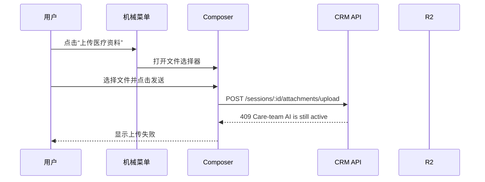
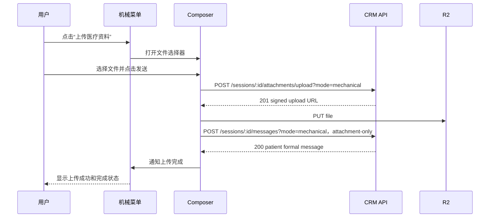
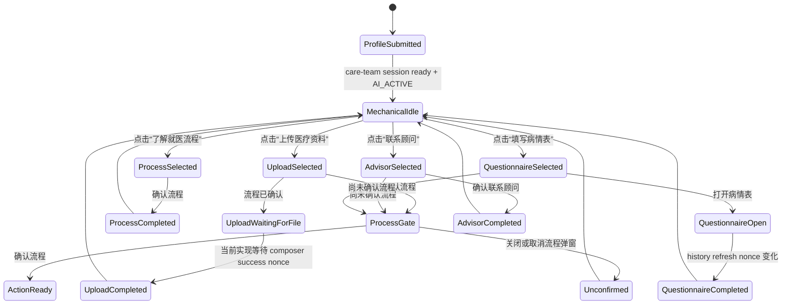
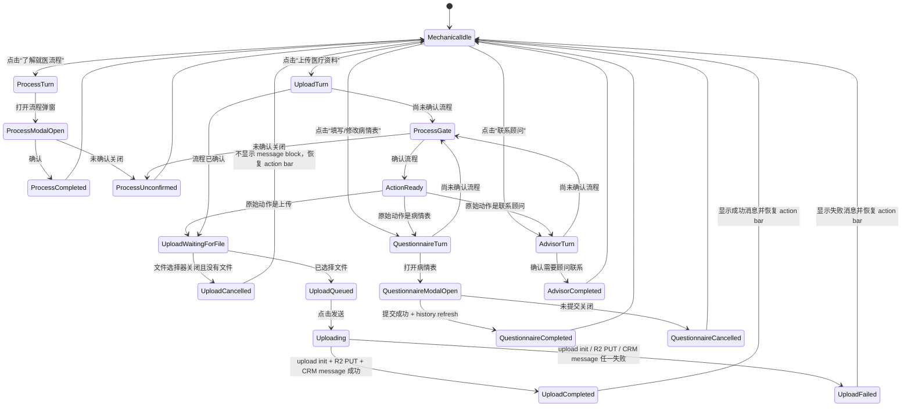

# 机械聊天状态机分析与设计

日期：2026-06-02

## 范围

本文档解释 MedicalTourismChina 患者聊天组件中“机械聊天”当前的行为，并定义一个更清晰的目标状态机。

这里的“机械聊天”指：用户完成基础建档后，右下角 widget 不再允许自由 AI 聊天，而是通过固定菜单继续推进病例流程。当前重点包括：

- 了解赴华就医流程。
- 上传医疗资料。
- 联系顾问。
- 填写或修改病情表。

本文档同时记录：

- 之前“上传医疗资料失败”的根因。
- 已部署的修复方式。
- 未来上传文件时应该如何在聊天框里显示 message block、loading、失败状态。
- 机械聊天记录应该如何持久化，避免只存在浏览器本地状态里。
- 所有机械回复和状态文案都必须国际化。

## 上传失败根因

之前的上传失败，不是 R2 本身优先出错，而是因为 widget 已经进入机械模式，但 CRM 中 care-team conversation 仍然处于 `AI_ACTIVE`。

修复前，前端尝试通过 formal care-team session 上传文件：



后端这个 guard 对普通自由聊天是合理的：当 care-team conversation 仍然是 `AI_ACTIVE` 时，用户不应该直接发送任意 formal message 给人工团队。但是“机械菜单上传”不是自由输入，而是固定菜单动作，所以需要一个受控例外。

已部署的修复方式是显式标记 mechanical upload：



后端 bypass 必须很窄：

- 只适用于患者 care-team session。
- 必须带 `mode=mechanical`。
- 上传初始化可以在 `AI_ACTIVE` 时通过。
- formal message 只有在 attachment-only 时可以通过。
- 只要有自由文本，仍然在 `AI_ACTIVE` 时被拒绝。

这样既保留了“不要继续自由 AI 聊天”的产品决策，也允许用户把医疗资料上传进 CRM case。

## 当前实现的问题

当前 mechanical chat 不是一个单一状态机，而是由几块状态拼起来的：

- `MechanicalChatMenu`
  - 维护本地 `turns`。
  - 维护乐观的流程确认状态。
  - 维护病情表是否完成。
  - 维护顾问联系是否完成。
- `PatientChatComposer`
  - 维护已选择的文件。
  - 维护发送中状态。
  - 决定走 formal session、chatbot session，还是没有 target。
- `PatientEntryWindow`
  - 决定是否启用 mechanical chat。
  - 把成功的 formal upload message 转换成 menu completion nonce。
- CRM API
  - 管理 `AI_ACTIVE` 和 `HUMAN_TAKEOVER` 权限。
  - 提供 mechanical upload bypass。

因为状态分散，所以容易出现这些混乱：

- 打开文件选择器就把 upload 标记为完成，即使用户没有选择任何文件。
- 上传成功没有立即在聊天流里显示一个带进度状态的 patient message block。
- 上传失败只暴露 API error，menu 没有干净的 failed 状态。
- 某个 selected turn 没退出时，action bar 会一直隐藏。
- 机械回复文案有硬编码，可能忽略用户当前语言。
- 机械消息大多只是本地 UI state，刷新页面后会丢失，CRM 里也看不到完整的用户旅程。

## 当前高层状态机

当前实现大致等价于下面的状态机：



这比之前“打开文件选择器就完成”的行为好，但仍然不完整：上传进度、上传失败、上传消息块、机械事件持久化都还不是一等状态。

## 目标状态机

目标状态机应该把每个机械动作都当作一个明确的 turn，而不是散落在多个组件的临时状态里。



## 状态规则

| 状态 | 聊天框显示内容 | Action bar | 文字输入 | 附件按钮 | 发送按钮 |
| --- | --- | --- | --- | --- | --- |
| `MechanicalIdle` | intro 和历史 completed turns | 显示 | 禁用 | 只在有 mechanical/formal target 时启用 | 有已选文件时才启用 |
| `ProcessTurn` | assistant pre-message + 流程触发卡片 | 隐藏 | 禁用 | 禁用 | 禁用 |
| `ProcessModalOpen` | 流程弹窗打开 | 隐藏 | 禁用 | 禁用 | 禁用 |
| `ProcessCompleted` | 流程确认完成消息 | 显示 | 禁用 | 取决于 target | 有已选文件时才启用 |
| `ProcessUnconfirmed` | 未确认提示消息 | 显示 | 禁用 | 取决于 target | 有已选文件时才启用 |
| `UploadWaitingForFile` | 上传说明卡片 | 隐藏 | 禁用 | 启用 | 选中文件前禁用 |
| `UploadCancelled` | 不显示上传 message block | 显示 | 禁用 | 取决于 target | 有已选文件时才启用 |
| `UploadQueued` | composer 文件 chips | 隐藏 | 禁用 | 启用 | 启用 |
| `Uploading` | patient 上传 message block + loading | 隐藏 | 禁用 | 禁用 | 禁用 |
| `UploadCompleted` | patient 上传 block 成功状态 + assistant 成功消息 | 显示 | 禁用 | 取决于 target | 有已选文件时才启用 |
| `UploadFailed` | patient 上传 block 失败状态 + assistant 失败提示 | 显示 | 禁用 | 启用 | 选中文件前禁用 |
| `AdvisorTurn` | 联系顾问卡片 | 隐藏 | 禁用 | 禁用 | 禁用 |
| `AdvisorCompleted` | 联系顾问完成消息 | 显示 | 禁用 | 取决于 target | 有已选文件时才启用 |
| `QuestionnaireTurn` | 病情表触发卡片 | 隐藏 | 禁用 | 禁用 | 禁用 |
| `QuestionnaireModalOpen` | 病情表弹窗打开 | 隐藏 | 禁用 | 禁用 | 禁用 |
| `QuestionnaireCompleted` | 病情表完成消息 | 显示 | 禁用 | 取决于 target | 有已选文件时才启用 |
| `QuestionnaireCancelled` | 不显示完成消息 | 显示 | 禁用 | 取决于 target | 有已选文件时才启用 |

## 上传 Message Block 状态

用户上传医疗资料时，上传文件应该作为 patient message block 出现在聊天流里。它不应该等所有网络请求完成后才出现，而是点击发送后立即出现，并带 loading 状态。

| 上传 block 状态 | 触发条件 | UI 行为 | 下一状态 |
| --- | --- | --- | --- |
| `file_selected` | 用户选择文件 | 只在 composer 里显示 file chips，不进入聊天流 | 点击发送后进入 `uploading`，移除所有文件后进入 `cancelled` |
| `uploading` | 用户点击发送 | 立即插入 patient message block，显示缩略图/文件卡片和 loading indicator | `uploaded` 或 `failed` |
| `uploaded` | R2 upload 和 CRM message 都成功 | loading 变成 success/check，message block 保留在聊天流 | mechanical action 完成 |
| `failed` | upload init、R2 PUT、proxy upload、CRM message 任一失败 | loading 变成 failed/error，追加 assistant 失败提示 | action bar 恢复显示 |
| `cancelled` | 文件选择器关闭但没有文件 | 不插入 message block，不显示完成 | action bar 恢复显示 |

失败 assistant message 必须国际化：

- English: `Upload failed. Please try uploading the file again.`
- 中文：`上传失败了，请重新上传这个文件。`

上传 block 自身也需要国际化状态标签：

- `Uploading...` / `正在上传...`
- `Uploaded` / `已上传`
- `Upload failed` / `上传失败`

## 机械聊天记录持久化

机械聊天虽然不是 AI 生成的自由回复，但它仍然是患者旅程的一部分，应该被保留。不能只存在 React local state 里。

### 为什么要持久化

- 用户刷新页面后，应该还能看到之前点过什么、确认过什么、上传过什么。
- 管理员在 CRM 里应该能看到患者经历了哪些机械步骤。
- 上传失败、未确认流程、取消病情表等事件对客服跟进有价值。
- 后续如果切换浏览器或重新登录，本地 state 不可靠。
- 机械消息也是 audit trail，应该能解释“为什么用户现在处于这个状态”。

### 推荐持久化层级

优先级应该是：

1. **Server 持久化为主**
   - 写入 CRM conversation/message history 或专门的 mechanical event table。
   - 作为最终可信来源。
   - 刷新页面、换设备、管理员查看都依赖 server。

2. **Local storage 作为短期 fallback**
   - 只用于网络失败、页面短暂恢复、optimistic UI。
   - 不应作为最终状态来源。
   - local state 应该有 TTL，并且一旦 server 同步成功就清理。

3. **React state 只用于当前渲染**
   - 负责当前 turn 的即时 UI。
   - 不能承载跨刷新、跨设备、跨会话的业务状态。

### 应该持久化哪些内容

建议持久化 mechanical event，而不是只持久化最终文案。

| 事件 | 是否持久化 | 说明 |
| --- | --- | --- |
| `MECHANICAL_CHAT_STARTED` | 是 | 用户进入机械菜单模式 |
| `ACTION_SELECTED` | 是 | 用户点击了哪个菜单动作 |
| `PROCESS_CONFIRMED` | 是 | 已确认赴华流程 |
| `PROCESS_DISMISSED` | 是 | 打开流程但未确认关闭 |
| `UPLOAD_FILE_SELECTED` | 可选 | 如果仅本地 file picker，不一定要持久化；不要存本地 file path |
| `UPLOAD_STARTED` | 是 | 用户点击发送，上传开始 |
| `UPLOAD_SUCCEEDED` | 是 | 文件上传成功，并包含 attachment metadata |
| `UPLOAD_FAILED` | 是 | 上传失败，记录错误类型，不记录敏感完整错误 |
| `QUESTIONNAIRE_OPENED` | 可选 | 可用于分析，但不是必须 |
| `QUESTIONNAIRE_SUBMITTED` | 是 | 病情表提交成功 |
| `QUESTIONNAIRE_DISMISSED` | 可选 | 用户打开后未提交 |
| `ADVISOR_HANDOFF_CONFIRMED` | 是 | 用户确认需要顾问联系 |

### Server 存储形态

推荐两种可选实现：

#### 方案 A：写入 conversation message history

把机械消息作为特殊 message 存入现有会话流：

- `senderRole`: `SYSTEM` 或 `ASSISTANT`
- `source`: `MECHANICAL`
- `content`: 当前语言下展示文案，或 server 根据 key 渲染
- `metadata`:
  - `mechanicalEventType`
  - `actionKey`
  - `turnId`
  - `status`
  - `locale`
  - `attachments`
  - `errorCode`

优点：

- CRM 和患者聊天历史天然能看到。
- 不需要另一个读取路径。
- 适合“机械回复也像聊天消息一样显示”的产品形态。

缺点：

- message table 会混入 UI event。
- 需要小心区分 human/admin message、AI message、mechanical message。

#### 方案 B：新建 mechanical event table

新增类似 `patient_mechanical_chat_event` 的表：

- `id`
- `patient_id`
- `case_id`
- `session_id`
- `turn_id`
- `event_type`
- `action_key`
- `status`
- `locale`
- `payload`
- `created_at`

优点：

- 状态机事件很干净。
- 更适合审计、恢复状态、分析漏斗。
- 可以由 API 聚合成聊天消息给前端。

缺点：

- 需要新增 API 和聚合逻辑。
- CRM message timeline 里如果想显示，需要额外 merge。

### 推荐选择

短期建议用 **方案 A**：把 mechanical messages/events 写入现有会话 history，并通过 `metadata.source = "mechanical"` 区分。

原因：

- 我们现在的患者 widget 本来就是聊天流。
- 上传 block、成功消息、失败消息都需要出现在同一个 chat stream 里。
- 管理员也更容易在 CRM conversation 里看到用户动作。
- 实现更快，风险更低。

中期如果机械流程变复杂，再把 `metadata` 里的事件抽象成独立 event table。

### 恢复规则

页面刷新时，前端不应该从空的 local `turns` 开始，而应该：

1. 拉取 session message history。
2. 从 `metadata.source = "mechanical"` 的消息恢复已完成动作。
3. 从最后一个未完成 mechanical turn 恢复 UI 状态。
4. 如果存在本地 pending upload，但 server 没有确认成功，则显示 failed/retry，而不是假装完成。
5. 如果 server 和 local 状态冲突，以 server 为准。

## 点击行为矩阵

| 用户动作 | 当前状态 | 预期行为 |
| --- | --- | --- |
| 点击“了解就医流程” | `MechanicalIdle` | 隐藏 action bar，追加 pre-message，显示流程触发卡片，并持久化 `ACTION_SELECTED` |
| 确认流程弹窗 | `ProcessModalOpen` | 持久化确认，追加完成消息，显示 action bar |
| 未确认关闭流程弹窗 | `ProcessModalOpen` | 追加未确认消息，显示 action bar，持久化 `PROCESS_DISMISSED` |
| 未确认流程时点击“上传医疗资料” | `MechanicalIdle` | 隐藏 action bar，追加 gated pre-message，显示流程触发卡片 |
| 为上传确认 gated process | `ProcessGate` | 持久化确认，保持 upload turn active，显示上传卡片 |
| 点击“选择文件上传” | `UploadWaitingForFile` | 打开文件选择器 |
| 关闭文件选择器且无文件 | `UploadWaitingForFile` | 不插入 message，恢复 action bar |
| 选择文件 | `UploadWaitingForFile` | composer 显示 file chips，保持 upload turn active |
| 带文件点击发送 | `UploadQueued` | 立即插入 uploading patient block，禁用 composer/action bar，持久化 `UPLOAD_STARTED` |
| 上传成功 | `Uploading` | block 变成功，追加成功 assistant message，显示 action bar，持久化 `UPLOAD_SUCCEEDED` |
| 上传失败 | `Uploading` | block 变失败，追加 retry assistant message，显示 action bar，持久化 `UPLOAD_FAILED` |
| 未确认流程时点击“联系顾问” | `MechanicalIdle` | 要求先确认流程 |
| 确认需要顾问联系 | `AdvisorTurn` | 追加 advisor post-message，隐藏 advisor action，显示 action bar，持久化事件 |
| 未确认流程时点击“填写病情表” | `MechanicalIdle` | 要求先确认流程 |
| 打开病情表 | `QuestionnaireTurn` | 打开病情表弹窗，保持 turn active |
| 提交病情表 | `QuestionnaireModalOpen` | 等待 history refresh，追加完成消息，显示 action bar，持久化提交 |
| 未提交关闭病情表 | `QuestionnaireModalOpen` | 不显示完成消息，显示 action bar，可选持久化 dismiss |

## 后端契约

Mechanical upload 不是普通 AI chat，也不是普通 human takeover messaging。

care-team conversation 仍然是 `AI_ACTIVE` 时允许：

- `POST /sessions/:sessionId/attachments/upload?mode=mechanical`
- `POST /sessions/:sessionId/messages?mode=mechanical`，但必须满足：
  - `attachments.length > 0`
  - `content.trim().length === 0`
  - target conversation 是患者 care-team session

care-team conversation 仍然是 `AI_ACTIVE` 时仍然禁止：

- formal free-text message。
- 带自由文本的 mechanical message。
- 没有 `mode=mechanical` 的 care-team formal message。

新增机械事件持久化后，建议新增一个 API：

- `POST /sessions/:sessionId/mechanical-events`

请求体示例：

```json
{
  "turnId": "mechanical:MEDICAL_RECORDS:...",
  "eventType": "UPLOAD_FAILED",
  "actionKey": "MEDICAL_RECORDS",
  "status": "failed",
  "locale": "en",
  "payload": {
    "fileNames": ["ct-scan.pdf"],
    "errorCode": "R2_UPLOAD_FAILED"
  }
}
```

如果短期采用方案 A，也可以让该 API 内部写入现有 conversation message history。

## 推荐重构

下一步实现应该把 mechanical chat 改成 reducer 驱动状态机。

建议类型：

```ts
type MechanicalState =
  | { status: 'idle'; completed: CompletedMechanicalActions }
  | { status: 'process_modal'; actionKey: MechanicalActionKey; gated: boolean }
  | { status: 'upload_waiting_for_file'; turnId: string }
  | { status: 'upload_queued'; turnId: string; files: File[] }
  | { status: 'uploading'; turnId: string; files: UploadingFileView[] }
  | { status: 'upload_failed'; turnId: string; files: FailedFileView[]; error: string }
  | { status: 'questionnaire_open'; turnId: string; repeat: boolean }
  | { status: 'advisor_pending'; turnId: string };

type MechanicalEvent =
  | { type: 'ACTION_SELECTED'; actionKey: MechanicalActionKey }
  | { type: 'PROCESS_CONFIRMED' }
  | { type: 'PROCESS_DISMISSED' }
  | { type: 'FILES_SELECTED'; files: File[] }
  | { type: 'FILE_PICKER_CANCELLED' }
  | { type: 'UPLOAD_STARTED'; optimisticMessageId: string }
  | { type: 'UPLOAD_SUCCEEDED'; messageId: string }
  | { type: 'UPLOAD_FAILED'; error: string }
  | { type: 'QUESTIONNAIRE_OPENED' }
  | { type: 'QUESTIONNAIRE_SUBMITTED' }
  | { type: 'QUESTIONNAIRE_DISMISSED' }
  | { type: 'ADVISOR_CONFIRMED' };
```

所有 UI 都应该从这个状态派生：

- action bar 是否显示。
- 文字输入是否禁用。
- 附件选择是否启用。
- Send 是否启用。
- 当前 assistant message 是什么。
- 当前 patient upload message block 是 uploading、uploaded 还是 failed。
- 哪些 mechanical events 需要持久化。

这样可以移除 `MechanicalChatMenu`、`PatientChatComposer`、`PatientEntryWindow` 和 API error 之间的隐藏耦合。

## 测试计划

下一步实现至少需要覆盖：

- 英文 mechanical menu 中所有菜单和机械回复都是英文。
- 中文 mechanical menu 中所有菜单和机械回复都是中文。
- 点击上传后取消文件选择，不显示 message block，也不显示完成状态。
- 选择文件并点击发送后，立即插入 uploading patient message block。
- 上传成功后，block 变成 uploaded，追加成功 assistant copy，并恢复 action bar。
- 上传失败后，block 变成 failed，追加 retry assistant copy，并恢复 action bar。
- mechanical attachment-only upload 使用 `mode=mechanical`。
- mechanical free-text send 在 `AI_ACTIVE` 时仍然被拒绝。
- 病情表只有在真实提交并刷新 history 后才完成。
- gated action 在确认流程后能回到原本选择的动作。
- mechanical messages/events 刷新页面后能从 server 恢复。
- local pending state 与 server state 冲突时，以 server 为准。

